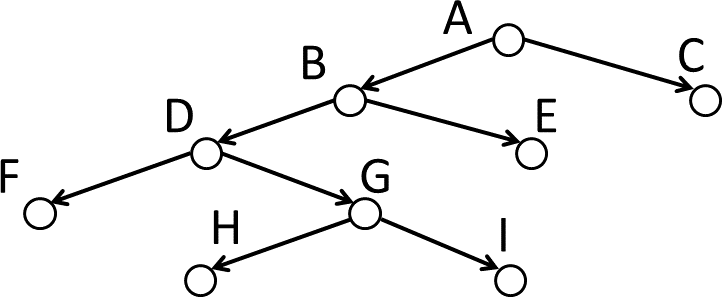

# 02-02


上記のグラフを、今回は簡易的に木構造で表現し、深さ優先探索(dfs),
幅優先探索(bfs)ができる関数をpython3で作成した。

ソースコードは以下のとおりである。また、ソースコードの解説はコメントにて記述した。

```python
class TreeNode:
  # TreeNode(ノードにもたせる値)
  # のようにして使う。
  # 各インスタンスは そのノードの値となるval, 左側の枝への参照となるleft,
  # 右側の枝への参照となるright をインスタンス変数に持つ。
  # 探索プログラムを簡易化する都合上、末尾にはNoneを値に持つノードを設定する。
  def __init__(self, val):
    self.val = val
    if val != None:
      self.left = TreeNode(None)
      self.right = TreeNode(None)

  # 左右の枝の値を設定する。
  def set_left_and_right(self, left=None, right=None):
    self.left = TreeNode(left)
    self.right = TreeNode(right)
    return self

# 今回の課題となるグラフを木構造で表現する。
def init_tree():
  root = TreeNode('A')
  b = root.set_left_and_right('B', 'C').left
  d = b.set_left_and_right('D', 'E').left
  g = d.set_left_and_right('F', 'G').right
  g.set_left_and_right('H', 'I')
  return root

# 深さ優先探索の関数。
def dfs(node, search_val):
  open_list = []
  closed_list = []
  # (1) 探索を開始する点をopen_listに入れる。closed_listは空。
  open_list.insert(0, node)

  count = 1
  while open_list: # (2) open_listが空なら探索は終了し、Noneを返す。
    print(f"loop: {count}")
    print(f"n: {open_list[0].val}, Left: {open_list[0].left.val}, Right: {open_list[0].right.val}")
    print(f"open_list: {list(map(lambda x: x.val, open_list))}")
    print(f"closed_list: {list(map(lambda x: x.val, closed_list))}")
    print("---------------------")
    subject_node = open_list.pop(0) # (3) open_listの先頭のn点を取り除き、
    closed_list.insert(0, subject_node) # closed_listに入れる。
    if subject_node.val == search_val: # (4) n が目標点なら探索は成功して終了
      return subject_node.val
    # 深さ優先探索固有のロジック
    if subject_node.right.val: # n の左右の枝（子）が存在すれば、
      open_list.insert(0, subject_node.right) # 全てopen_listの先頭に入れる
    if subject_node.left.val:
      open_list.insert(0, subject_node.left)
    # ここまで
    count += 1
  return None

# 幅優先探索の関数。
def bfs(node, search_val):
  open_list = []
  closed_list = []
  # (1) 探索を開始する点をopen_listに入れる。closed_listは空。
  open_list.insert(0, node)

  count = 1
  while open_list: # (2) open_listが空なら探索は終了し、Noneを返す。
    print(f"loop: {count}")
    print(f"n: {open_list[0].val}, Left: {open_list[0].left.val}, Right: {open_list[0].right.val}")
    print(f"open_list: {list(map(lambda x: x.val, open_list))}")
    print(f"closed_list: {list(map(lambda x: x.val, closed_list))}")
    print("---------------------")
    subject_node = open_list.pop(0) # (3) open_listの先頭のn点を取り除き、
    closed_list.insert(0, subject_node) # closed_listに入れる。
    if subject_node.val == search_val: # (4) n が目標点なら探索は成功して終了
      return subject_node.val
    # 深さ優先探索固有のロジック
    if subject_node.left.val: # n の左右の枝（子）が存在すれば、
      open_list.append(subject_node.left) # 全てopen_listの末尾に入れる
    if subject_node.right.val:
      open_list.append(subject_node.right)
    # ここまで
    count += 1
  return None

def main():
  root = init_tree()
  print('================')
  print('dfs start')
  print('================')
  result = dfs(root, 'C')
  print(result)

  print('================')
  print('bfs start')
  print('================')
  result = bfs(root, 'I')
  print(result)

main()
```

# 参考文献
Python Software Foundation."5. データ構造 — Python 3.11.4 ドキュメント".https://docs.python.org/ja/3/tutorial/datastructures.html
